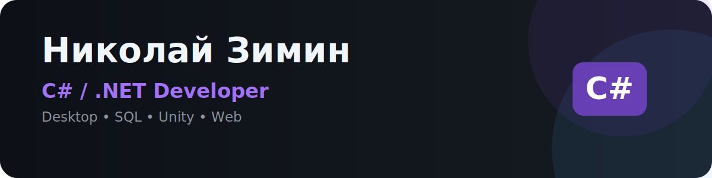

# Николай Зимин

### C# / .NET Developer

Начинающий разработчик. Создаю настольные приложения, информационные системы, игры и веб-проекты.

---

## Обо мне

Я выпускник Красноярского колледжа радиоэлектроники и информационных технологий по специальности **09.02.07 «Информационные системы и программирование»**, квалификация — **программист**.

Основное направление — разработка на **C# и платформе .NET**. За время обучения создал несколько законченных проектов: информационную систему управления производством, 2D-игру на Unity, Telegram-бота и веб-сайты.

Сейчас ищу первую позицию **C#/.NET Developer** и продолжаю развивать навыки разработки, работы с базами данных и архитектуры приложений.

---

## Технологии

**Основной стек:** `C#` `.NET` `Windows Forms` `SQL` `Git`  
**Дополнительный опыт:** `Unity` `Python` `HTML5` `CSS3` `JavaScript` `Qt Designer` `Android Studio`

---

## Основные проекты

### Slipkife — информационная система управления производством

Настольное приложение для автоматизации процессов предприятия по производству матрасов.

**Реализовано:**

- ролевая модель пользователей;
- управление заказами и производственными процессами;
- складской учет материалов;
- финансовая аналитика;
- экспорт отчетов в Excel;
- работа с реляционной базой данных.

**Стек:** `C#` `Windows Forms` `SQL` `ClosedXML`

> [Открыть репозиторий →](https://github.com/zimin-nikolay/Slipkife)

---

### Приключения рыцаря Шакса

Учебная 2D-игра, созданная в Unity.

**Реализовано:**

- управление персонажем;
- система здоровья и боя;
- поведение противников;
- анимации и пользовательский интерфейс;
- игровые уровни;
- часть графических ассетов создана самостоятельно в Photoshop и Paint Tool SAI.

**Стек:** `Unity` `C#`

> Ссылка на репозиторий будет добавлена после публикации проекта.

---

### Гид по Красноярску

Telegram-бот для знакомства с достопримечательностями и мероприятиями города.

**Реализовано:**

- регистрация пользователей;
- личный кабинет;
- просмотр категорий, локаций и мероприятий;
- сохранение посещений;
- хранение данных в SQLite.

**Стек:** `Python` `aiogram` `SQLite`

> Исходный код утрачен; сохранились база данных, документация и скриншоты работы проекта.

---

### Краски Леса

Адаптивный веб-сайт для проекта «Краски Леса».

**Реализовано:**

- адаптивная верстка;
- каталог продукции;
- модальные окна;
- фотогалерея;
- мобильное меню;
- интерактивные элементы на JavaScript.

**Стек:** `HTML5` `CSS3` `JavaScript`

> Ссылка на сайт и репозиторий будет добавлена после публикации.

---

## Дополнительные проекты

Также создавал учебные сайты, небольшие приложения на Qt и Android Studio.

---

## Использование ИИ-инструментов

Использую современные ИИ-инструменты для анализа кода, поиска решений, подготовки прототипов и изучения новых технологий. Проверяю результат вручную и адаптирую решения под задачу.

---

## Сейчас развиваю

- C# и экосистему .NET;
- проектирование приложений;
- SQL и работу с базами данных;
- Git и оформление проектов;
- качество и читаемость кода.

---

## Контакты

- **GitHub:** https://github.com/zimin-nikolay
- **Telegram:** `@zkolyan4ikz`
- **Email:** `ziminne2006@mail.com`
- **Город:** Красноярск

---

### Открыт к предложениям на позицию C#/.NET Developer

